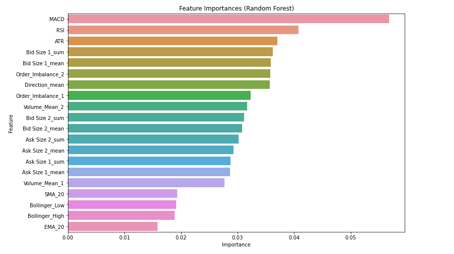
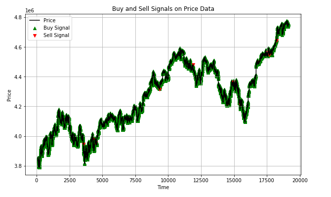
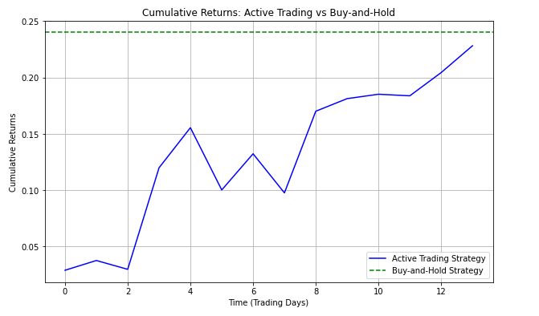

# MSc Thesis – Mid-Price Prediction on Limit Order Book Data using Machine Learning

## Overview
This repository contains the code from my MSc thesis in Economics (cand.polit.) 
from the University of Copenhagen. The project predicts the mid-price direction 
of the SPDR S&P 500 ETF Trust (Ticker: SPY) using machine learning models trained 
on high-frequency limit order book data.

## Data
- **Source:** LOBSTER (Limit Order Book System – The Efficient Reconstructor)
- https://php.lobsterdata.com/info/WhatIsLOBSTER.php
- **Asset:** SPDR S&P 500 ETF Trust (Ticker: SPY)
- **Period:** April 2016 – December 2023 (~2,006 trading days)
- **Raw data:** >1 TB of nanosecond-resolution tick data
- **Used:** ~960 GB after processing
- **Note:** Data not included due to size and licensing restrictions

## Methodology

### 1. Raw Data Structure
- Each trading day consists of two files: a message book and an order book
- Each file contains several million observations at nanosecond resolution
- Files were processed by looping through yearly folders, merging message and 
  order book files pair-by-pair per trading day

### 2. Data Processing
- Merged message book and order book files for each trading day (251 days per year)
- Resampled from nanosecond resolution → 1-second data (first observation per second)
- Resampled further to 5-minute intervals
- Processed across 8 years (2016–2023)

### 3. Feature Engineering
Base features calculated on mid-price and order book levels:
- Mid-Price, Spread, Volume Mean, Order Imbalance, VWAP (level 1 and 2)

Technical indicators, added prior to model training:
- Simple Moving Average (SMA) and Exponential Moving Average (EMA)
- RSI (Relative Strength Index)
- MACD (Moving Average Convergence Divergence)
- Bollinger Bands (upper and lower)
- ATR (Average True Range)
- Target variable: Direction (1 = up, -1 = down)

*Note: Indicator window lengths differ between the 1-second and 5-minute 
models to reflect the difference in data frequency.*

### 4. Rolling Window Approach
Expanding rolling window to simulate real-world out-of-sample forecasting:
- Train on 2016 → Test on 2017
- Train on 2016–2017 → Test on 2018
- Train on 2016–2018 → Test on 2019
- ...
- Train on 2016–2022 → Test on 2023

### 5. Models

**Random Forest Classifier**
- Hyperparameter tuning via GridSearchCV / RandomizedSearchCV
- TimeSeriesSplit (6 folds) to respect temporal order
- Best result: **55.81% accuracy** on 2023 out-of-sample data

**Support Vector Machine (SVM)**
- GridSearchCV with RBF kernel
- Parameters: C (0.1, 1, 10), gamma (scale, 0.1, 1, 10)
- StandardScaler normalization applied before training
- TimeSeriesSplit (6 folds)
- Result: ~50% accuracy

### 6. Trading Simulation
Simple long-only strategy based on model predictions:
- Starting capital: DKK 10,000
- Buy when model predicts up (direction = 1)
- Sell when model predicts down (direction = -1)
- No transaction costs included
- Result: DKK 10,052 (+0.53%) on 2023 out-of-sample data

## Results Summary

| Model         | Frequency | Best Accuracy |
| ------------- | --------- | ------------- |
| Random Forest | 1-second  | 55.81%        |
| Random Forest | 5-minute  | ~52%          |
| SVM           | 5-minute  | ~50%          |

## Results

### Feature Importance

MACD and RSI were the most influential features, ranking above raw order 
book metrics such as bid/ask size.

### Buy and Sell Signals (2023)

### Cumulative Returns: Active Trading vs Buy-and-Hold

The active trading strategy underperformed a simple buy-and-hold approach 
for most of 2023, narrowing the gap only toward year-end.

## Computational Notes
Due to computational constraints on a standard desktop PC (Intel Core i5, 
6 cores, 12 threads), the full hyperparameter grid search was reduced to 
a feasible subset.

- A complete grid search across all hyperparameters would require an estimated 
  **~12 days** of continuous computation
- To balance accuracy and runtime, the parameter space was reduced, resulting in 
  **1,922 models evaluated**
- SVM 5-minute estimation runtime: **~10 hours**
- Random Forest 5-minute estimation runtime: **~12 hours**

A more exhaustive hyperparameter search on a high-performance computing cluster 
would likely improve model performance further.

## Repository Structure

**Data processing**
- data_processing_2016.ipynb – data_processing_2023.ipynb (8 files, one per year) — merges message/order book files per trading day, resamples to 1-second and 5-minute intervals

**Feature engineering**
- base_features_1sec_2016.ipynb – base_features_1sec_2023.ipynb (8 files) — Mid-Price, Spread, Volume Mean, Order Imbalance, VWAP on 1-second data
- base_features_5min_2016.ipynb – base_features_5min_2023.ipynb (8 files) — same features on 5-minute data

**Models**
- random_forest_5min_training.ipynb — adds technical indicators (SMA, EMA, RSI, MACD, Bollinger Bands, ATR), trains Random Forest via rolling window
- random_forest_5min_evaluation.ipynb — evaluates trained 5-minute RF models
- random_forest_1sec_evaluation.ipynb — evaluates 1-second RF models and runs trading simulation on out-of-sample 2023 data
- svm_5min_training.ipynb — trains SVM via rolling window
- svm_5min_evaluation.ipynb — evaluates trained SVM models

**Results**
- feature_importance.png, buy_sell_signals_2023.png, cumulative_returns_vs_buyhold.png — result figures referenced above

## Tools & Libraries
- Python 3.8
- pandas, numpy
- scikit-learn (RandomForestClassifier, SVC, GridSearchCV, RandomizedSearchCV)
- ta (Technical Analysis library)
- joblib

## Author
Tuan Anh Nguyen – MSc in Economics (cand.polit.), University of Copenhagen (2024)
